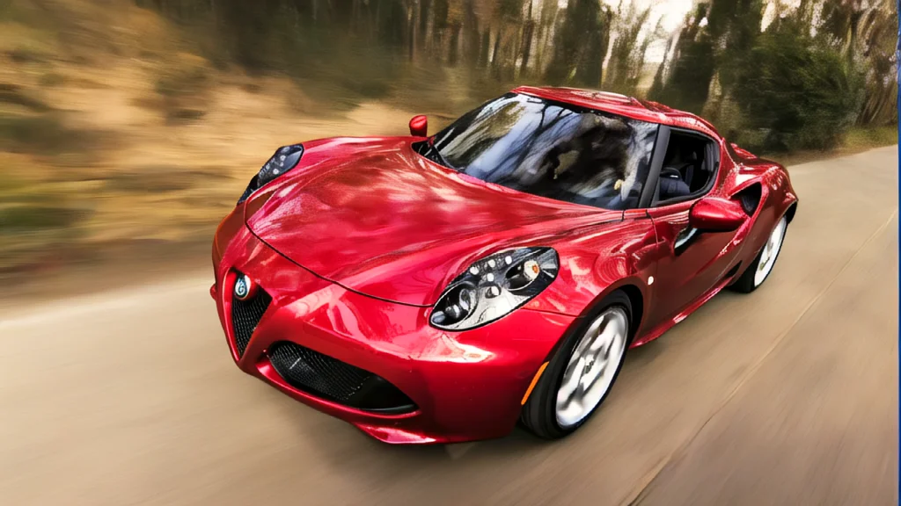
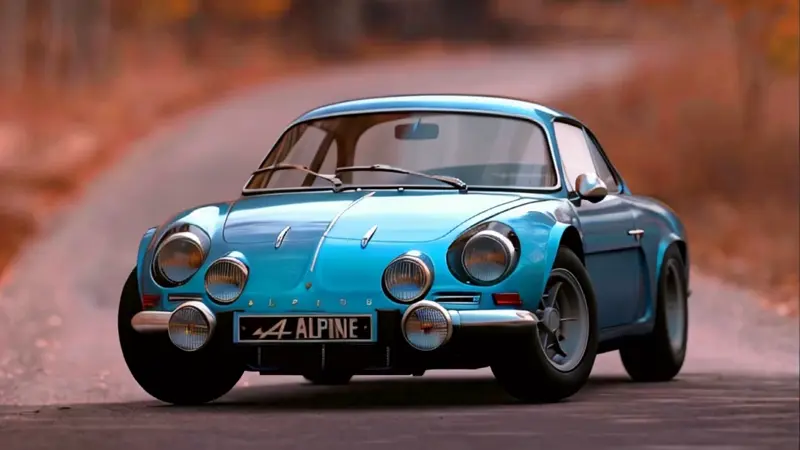
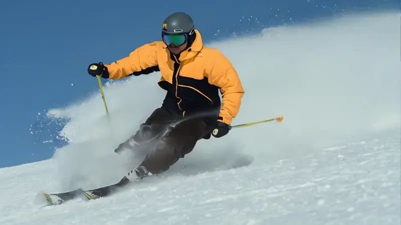
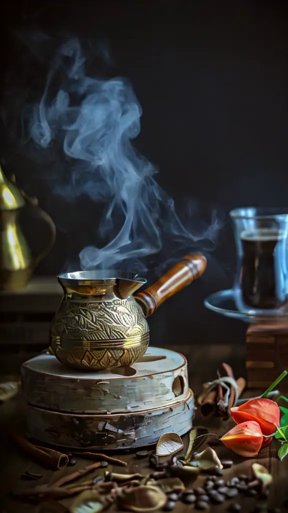

# Stable Video Diffusion Examples

All videos were created with [Stability AI](https://stability.ai/stable-video)ʼs latest Stable Video Diffusion 1.1 Image-to-Video latent diffusion model (SVD 1.1), available on [Hugging Face](https://huggingface.co/stabilityai/stable-video-diffusion-img2vid-xt-1-1). These videos were created on Amazon Web Services (AWS) from single images using the SVD 1.1 model and [ComfyUI](https://github.com/comfyanonymous/ComfyUI) on a G4dn instance, powered by NVIDIA T4 GPUs. The videos were rendered as MP4 files with 25 frames at an average of 9 fps and a resolution of 1024 x 576 pixels. The MP4 files were then converted to a reduced quality [WebP](https://developers.google.com/speed/webp) format for display in GitHub, shown below.

<table>
   <tr>
      <td>
       <a href="https://www.pexels.com/photo/red-alfa-romeo-c4-on-road-near-trees-210019">Source image</a></td>
      <td>
       <a href="https://pxhere.com/en/photo/1551833">Source image</a></td>
   </tr>
   <tr>
      <td>
       <a href="https://www.shutterstock.com/image-photo/happy-romantic-middle-aged-couple-enjoying-352166360">Source image</a></td>
      <td>
       <a href="https://www.pexels.com/photo/man-using-ski-3193846/">Source image</a></td>
   </tr>
   <tr>
      <td>
       <a href="https://www.pexels.com/photo/person-riding-motorcycle-on-road-2519371/">Source image</a></td>
   </tr>
   <tr>
      <td>
       <a href="https://www.pexels.com/photo/a-shot-of-steaming-pot-with-a-and-glass-with-a-beverage-10351409/">Source image</a></td>
      <td>
       <a href="https://www.pexels.com/photo/close-up-of-beer-glass-against-black-background-255483/">Source image</a></td>
   </tr>
   <tr>
      <td>
       <a href="https://www.pexels.com/photo/white-candle-278823/">Source image</a></td>
      <td>
       <a href="https://www.pexels.com/photo/red-smoke-illustration-604671/">Source image</a></td>
   </tr>
   <tr>
      <td>
       <a href="https://www.pexels.com/photo/gato-otaku-19138491//">Source image</a></td>
   </tr>
</table>
 

Gary A. Stafford, 2024

