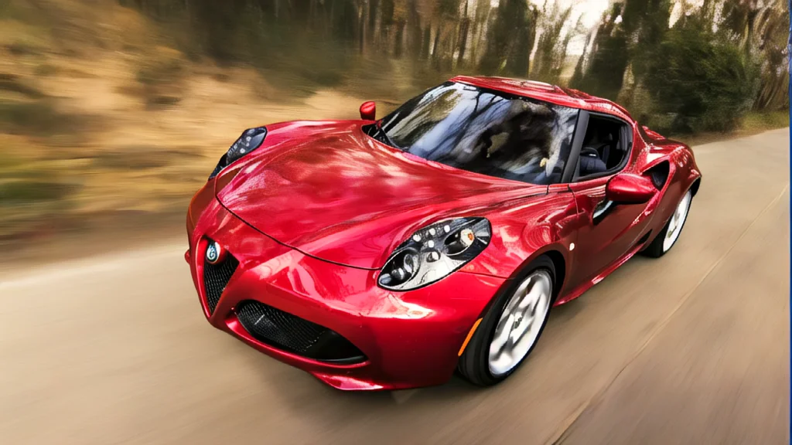
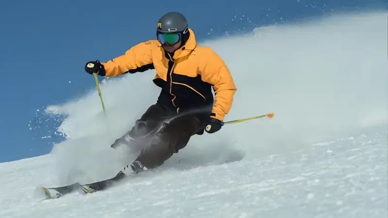

# Stable Video Diffusion Examples

Created with Stability AIʼs latest Stable Video Diffusion 1.1 Image-to-Video latent diffusion model (SVD 1.1), available on [Hugging Face](https://huggingface.co/stabilityai/stable-video-diffusion-img2vid-xt-1-1). I created this video on Amazon Web Services (AWS) with single images using the SVD 1.1 model and [ComfyUI](https://github.com/comfyanonymous/ComfyUI) on a G4dn instance, powered by NVIDIA T4 GPUs. The output was an MP4 file with 25 frames at 9 fps and a resolution of 1024 x 576 pixels.

